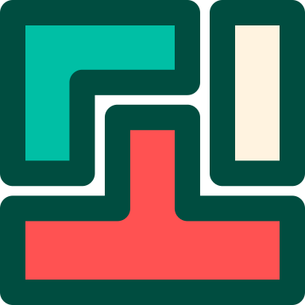

### <p style="text-align: center;">Tetron!</p>



**<p style="text-align: center;">Tetris as an electron application for mac and windows!</p>**

### Getting Started

- install [node](https://nodejs.org/en/download/)
- install [yarn](https://yarnpkg.com/lang/en/docs/install)

Run the following:

```
yarn && yarn build && yarn start
```

To see development console:

```
NODE_ENV=development yarn build && yarn start
```

### Gameplay

- Use Ctrl key to rotate left, and Meta key to rotate right
- Use arrow keys to move pieces to right and left, and to accelerate downward movement
- Use escape key to pause game
